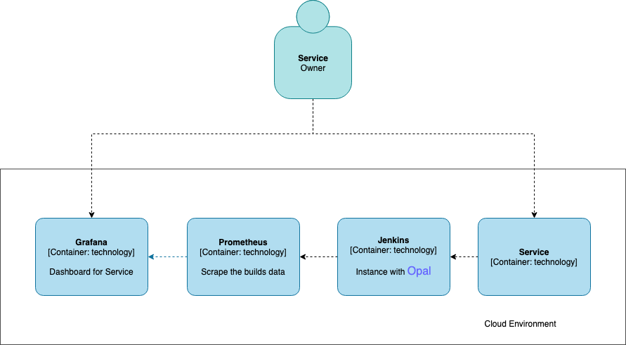
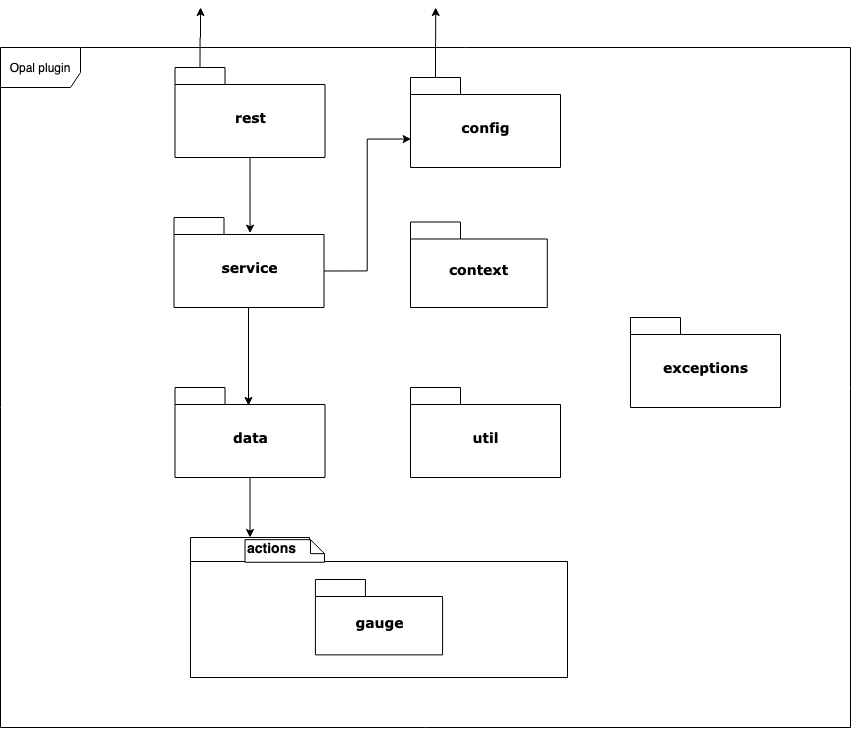
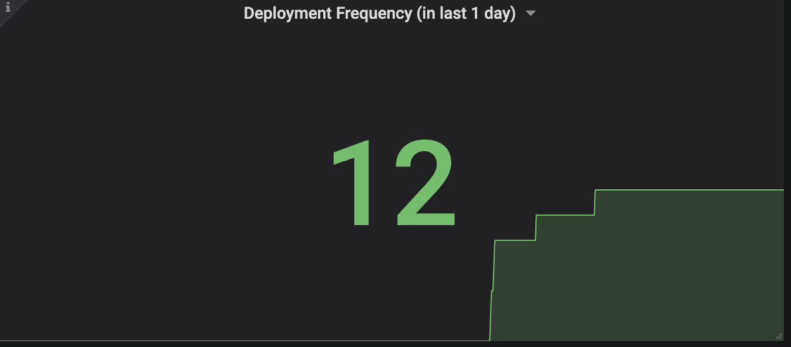
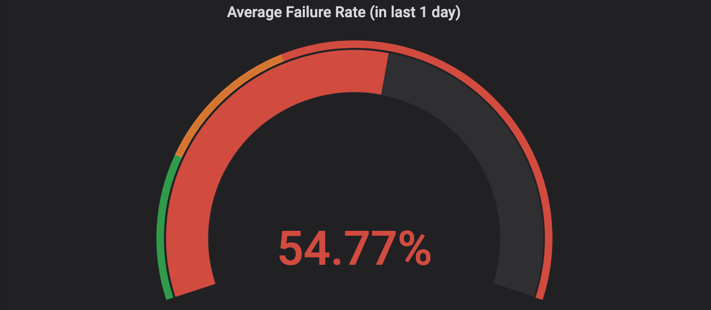
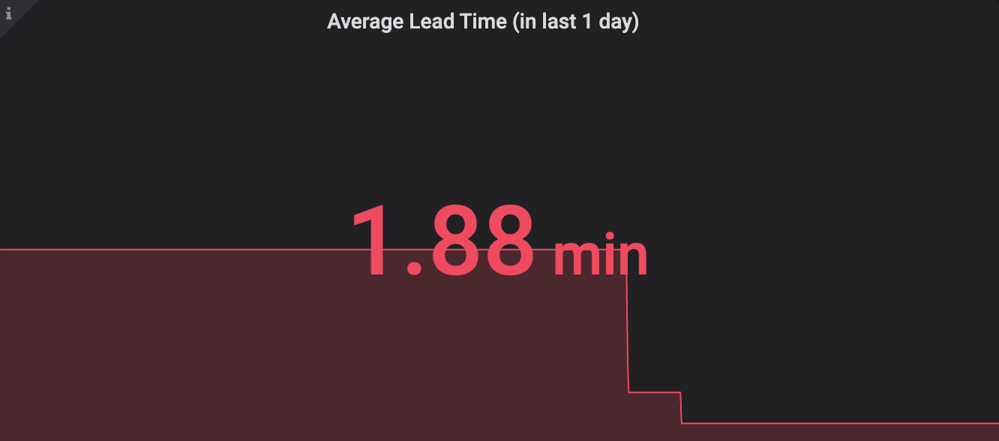
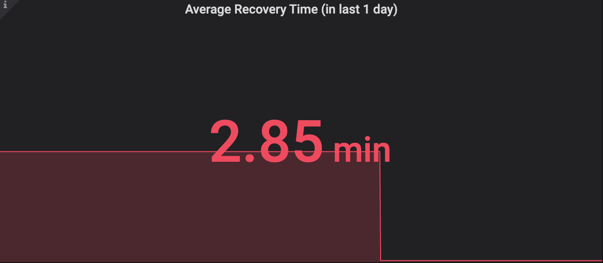
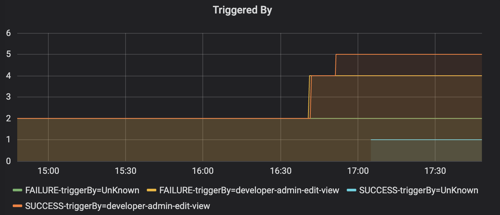
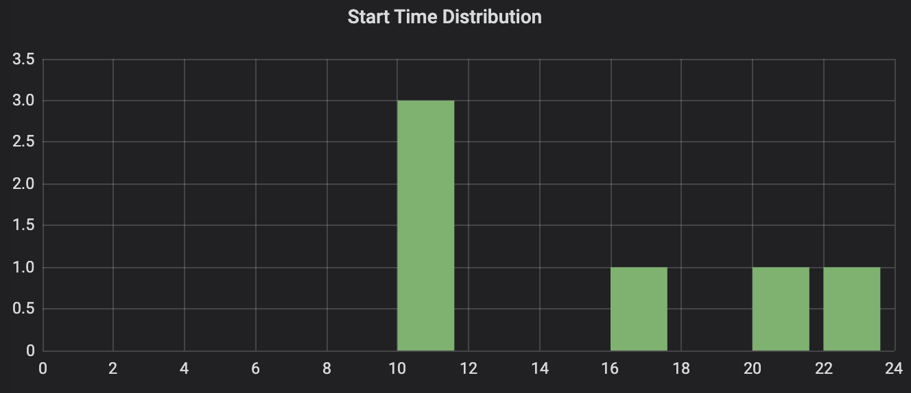
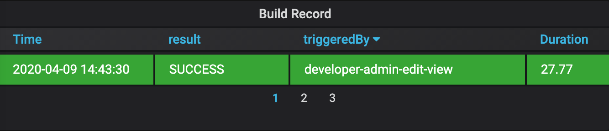

# build-metrics-collector-plugin
## About
Jenkins Build Metrics Collector Plugin expose an endpoint (default `/prometheus`) with metrics where a Prometheus Server can scrape.

The collected data could help to evaluate software delivery and operational performance.

## Presume
1. The plugin only supports data statistics for each single pipeline, and does not support consolidated data for multiple pipelines.
For example if you want to calculate the data of production environment, just choose the pipeline for production. 

2. For the delivery lead time, we assume that the pipeline will be triggered by the pushed code, so we can use the pipeline start time to calculate the
code delivery time from codebase to environment.

3. This plugin will provide data to the prometheus which is a real-time database, so we will not calculate for the historical data in the jenkins. 
Only care the current status.

## Environment variables
`COLLECTING_METRICS_PERIOD_IN_SECONDS` Async task period in seconds (Default: `15` seconds), which is used to refresh the metrics data. 

**Notice:** this value should be equal to the scrape_interval of the prometheus to ensure the correctness of the metrics data.

## System Context



## Implement Context


## Collected data
**Values**
* *default_jenkins_builds_last_build_duration_in_millisecond*: Last Build duration times in milliseconds
* *default_jenkins_builds_last_build_start_timestamp*: Last Build start time in milliseconds
* *default_jenkins_builds_failed_build_recovery_time*: Failed Build recovery time in milliseconds
* *default_jenkins_builds_merge_lead_time*: Code delivery time from codebase to environment in milliseconds

**Labels**
* *jenkinsJob*: the job name for the builds
* *triggeredBy*: the one who triggered this build
* *result*: the result of the build

## Prometheus query example

**Deployment Frequency In One Day:**
```
sum(count_over_time(default_jenkins_builds_last_build_duration_in_milliseconds{jenkinsJob="metrics-dev/metrics-dev-sample-pipeline"}[1d]))
```


**Average Failure Rate In One Day:**
```
sum(count_over_time(default_jenkins_builds_last_build_duration_in_milliseconds{jenkinsJob="metrics-dev/metrics-dev-sample-pipeline",result="FAILURE"}[1d]))/sum(count_over_time(default_jenkins_builds_last_build_duration_in_milliseconds{jenkinsJob="metrics-dev/metrics-dev-sample-pipeline"}[1d]))
```


**Average Lead Time In One Day:**
```
sum(sum_over_time(default_jenkins_builds_merge_lead_time[1d]))/sum(count_over_time(default_jenkins_builds_merge_lead_time[1d]))
```


**Average Recovery Time In One Day:**
```
sum(sum_over_time(default_jenkins_builds_failed_build_recovery_time[1d]))/sum(count_over_time(default_jenkins_builds_failed_build_recovery_time[1d]))
```


**Triggered By:**
```
count_over_time(default_jenkins_builds_last_build_duration_in_milliseconds{jenkinsJob="metrics-dev/metrics-dev-sample-pipeline",result=~".*"}[1d])
```


**Start Time:**
```
(hour(default_jenkins_builds_last_build_start_timestamp{jenkinsJob="metrics-dev/metrics-dev-sample-pipeline",result=~".*"}/1000)+8)
```


**Build Record:**
```
default_jenkins_builds_last_build_duration_in_milliseconds{jenkinsJob="metrics-dev/metrics-dev-sample-pipeline"}/1000
```
