# Opal
This plugin mainly collects Jenkins pipeline metrics to help evaluate software delivery and operational performance. 
The plugin currently has two major functionalities:
* expose an endpoint (default `/prometheus`) with metrics where a Prometheus Server can scrape.
* build some metrics chart on Jenkins dashboard

you can get opal at [here](https://drive.google.com/file/d/1MyXIXdEswqKTDqDm6XOSdgtbQVqSd_G8/view?usp=sharing)


## Presume
1. The plugin only supports data statistics for each single pipeline, and does not support consolidated data for multiple pipelines.
For example if you want to calculate the data of production environment, just choose the pipeline for production. 

2. For the delivery lead time, we assume that the pipeline will be triggered by the pushed code, so we can use the pipeline start time to calculate the
code delivery time from codebase to environment.

3. This plugin will provide data to the prometheus which is a real-time database, so we will not calculate for the historical data in the jenkins. 
Only care the current status.

## configuration
* Opal Refresh Period

  `COLLECTING_METRICS_PERIOD_IN_SECONDS` under **Jenkins** -> **Manage Jenkins** -> **Configure System**.

Async task period for collect pipeline data in seconds (Default: `15` seconds), which is used to refresh the metrics data. 
  
   *Note: this value should be **equal** to the scrape_interval of the prometheus to ensure the correctness of the metrics data.*
  
* Collect by Opal

  **General Configure** under each pipeline job, Opal will collect this pipeline data only after check it.
  
  
## Implement Context

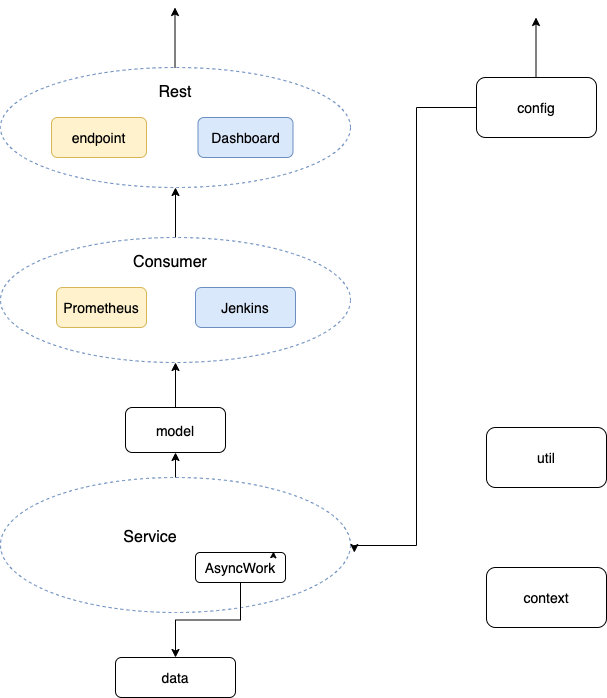


## Prometheus

### System Context
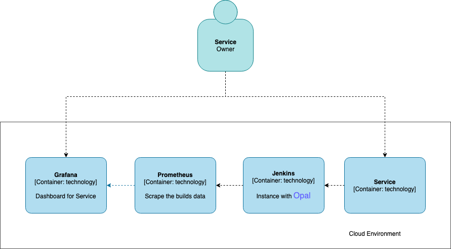


### Collected data
**Values**
* *default_jenkins_builds_last_build_duration_in_millisecond*: Last build duration times in milliseconds
* *default_jenkins_builds_last_build_start_timestamp*: Last build start time in milliseconds
* *default_jenkins_builds_failed_build_recovery_time*: Failed Build recovery time in milliseconds
* *default_jenkins_builds_merge_lead_time*: Code delivery time from codebase to environment in milliseconds

**Labels**
* *jenkinsJob*: the job name for the builds
* *triggeredBy*: the one who triggered this build，anonymous user will be Unknown User
* *result*: the result ordinal of the build

## Prometheus query example

**Deployment Frequency In One Day:**
```
sum(count_over_time(default_jenkins_builds_last_build_duration_in_milliseconds{jenkinsJob="metrics-dev/metrics-dev-sample-pipeline",result!="ABORTED"}[1d]))
```
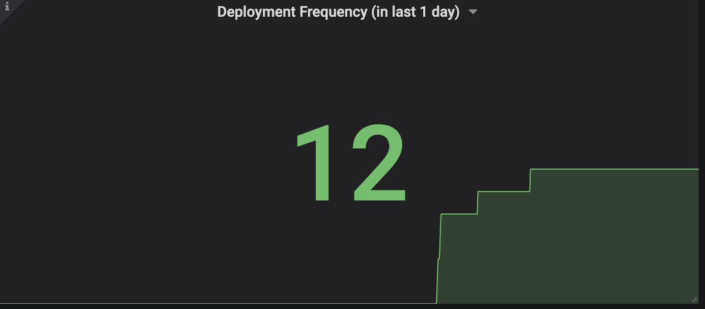

**Average Failure Rate In One Day:**
```
sum(count_over_time(default_jenkins_builds_last_build_duration_in_milliseconds{jenkinsJob="metrics-dev/metrics-dev-sample-pipeline",result="FAILURE"}[1d]))/sum(count_over_time(default_jenkins_builds_last_build_duration_in_milliseconds{jenkinsJob="metrics-dev/metrics-dev-sample-pipeline",result!="ABORTED"}[1d]))
```
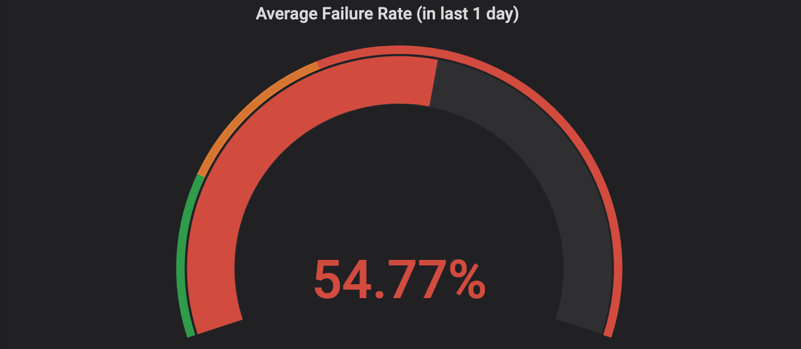

**Average Lead Time In One Day:**
```
sum(sum_over_time(default_jenkins_builds_merge_lead_time[1d]))/sum(count_over_time(default_jenkins_builds_merge_lead_time[1d]))
```
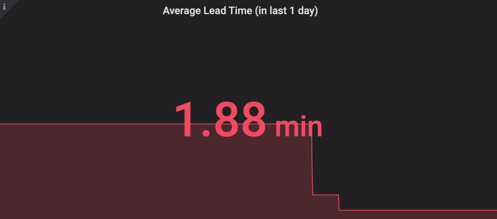

**Average Recovery Time In One Day:**
```
sum(sum_over_time(default_jenkins_builds_failed_build_recovery_time[1d]))/sum(count_over_time(default_jenkins_builds_failed_build_recovery_time[1d]))
```
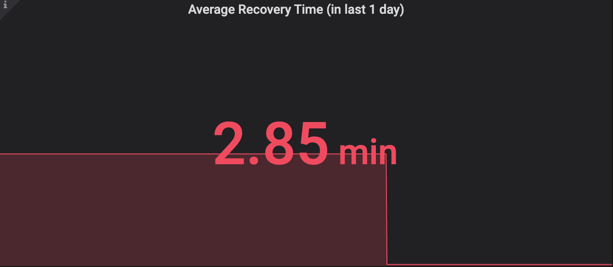

**Triggered By:**
```
count_over_time(default_jenkins_builds_last_build_duration_in_milliseconds{jenkinsJob="metrics-dev/metrics-dev-sample-pipeline",result=~".*"}[1d])
```
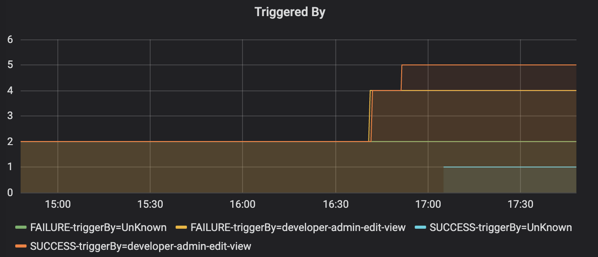

**Start Time:**
```
(hour(default_jenkins_builds_last_build_start_timestamp{jenkinsJob="metrics-dev/metrics-dev-sample-pipeline",result=~".*"}/1000)+8)
```
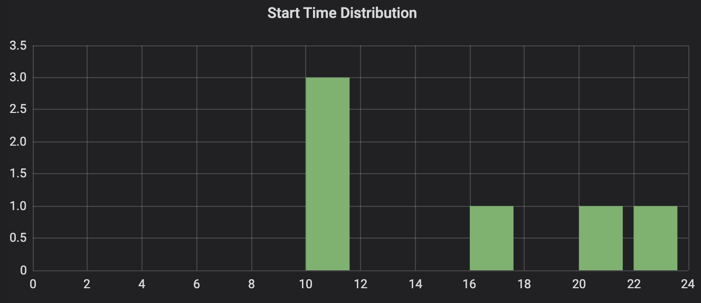

**Build Record:**
```
default_jenkins_builds_last_build_duration_in_milliseconds{jenkinsJob="metrics-dev/metrics-dev-sample-pipeline"}/1000
```
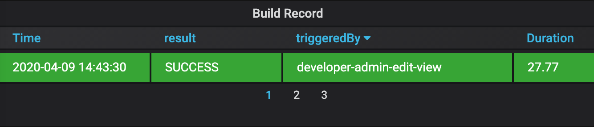


## Jenkins Dashboard
Opal provides two pipeline metrics Dashboard directly on the Jenkins web page. The first one is **OpalDashboard** on the home page, here you can view all collected job metrics chartanother one is **OpalJobDashboard**, under specific job which show it's metrics chart.

### Overall view 

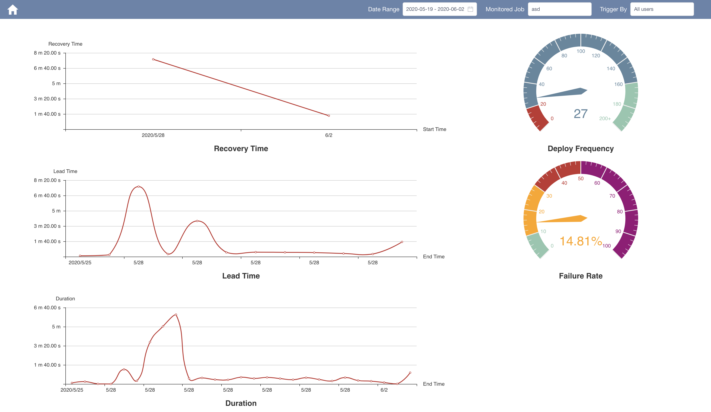

now this plugin provide 3 line chart, 2 gauge and 1 histogram to display the build metrics, and it support filter by JobName, Trigger user and date.

### Specific Chart
**Recovery Time**

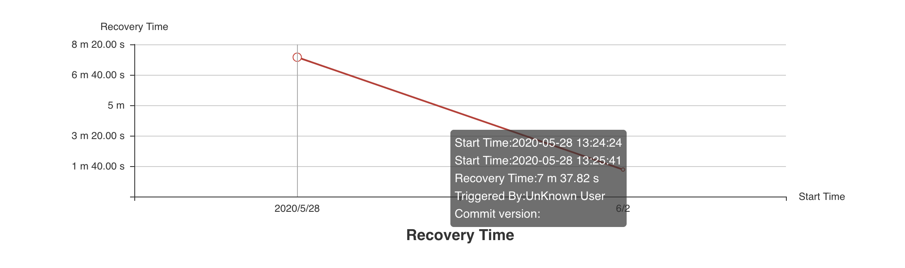

*note*: build detail, such as start time, trigger user, commit version, can be viewed in tooltip.

**Lead Time**

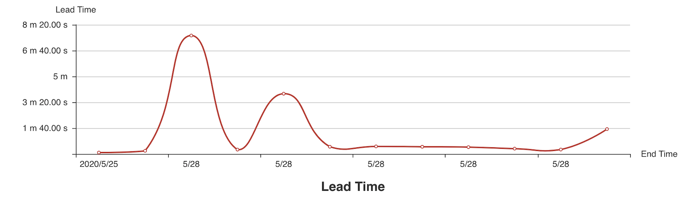

*note*: same as the recovery time tooltip

**Duration**

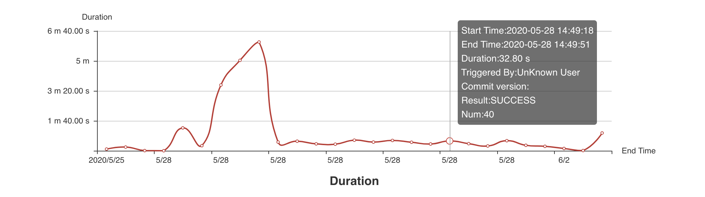

*note*: tooltip includes more details, result, build number, almost all build information, and you can click the 		build point and go to the build detail page of jenkins to get more information

**deploy time Distribution**

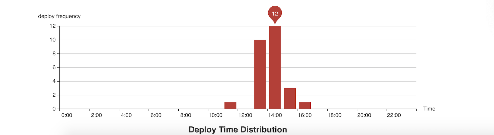

*note:* you can see the deploy frequency distribution of each day, and it will highlight the counts of most  		frequent range.

**Deploy Frequency, Failure Rate**


